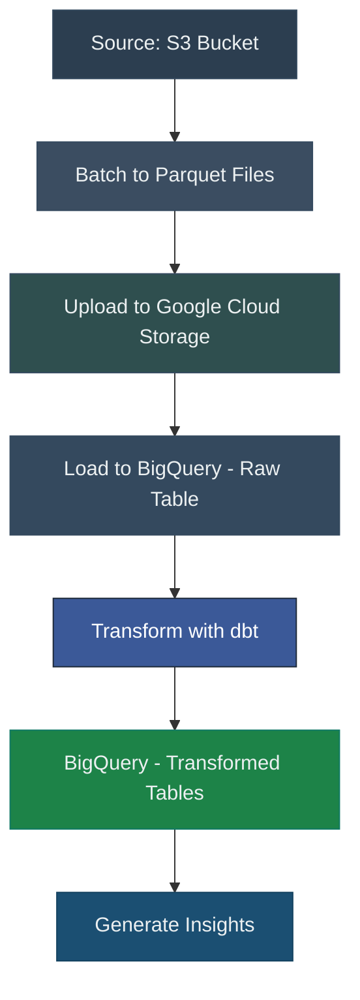

# ETL Pipeline Project: S3 to GCS to BigQuery with dbt Transformations

## Overview

This project demonstrates a scalable and production-ready ETL pipeline that processes Kindle product reviews data. The pipeline is designed to extract data from Amazon S3, transform and analyze it using Google Cloud Storage (GCS) and BigQuery, and apply advanced SQL transformations via dbt. It also integrates Docker for containerization and Apache Airflow for orchestration.

**Key Features**:
- **Data Ingestion:** Validates and ingests data from Amazon S3.
- **Data Transformation:** Converts raw CSV files into Parquet for optimized processing.
- **Cloud Integration:** Stores intermediate data in GCS and performs analytics in BigQuery.
- **Orchestration:** Automates the entire workflow using Airflow DAGs.
- **Insights:** Extracts meaningful insights, including best/worst-performing products and trending items.
- **Flagging System:** Identifies products with a recent spike in negative reviews for potential defect detection.

---

## Dataset and Scenario

The dataset contains Kindle product reviews, including:
- Product IDs
- Review scores
- Review text
- Timestamps

### Transformation Goals:
1. **Best Performing Products:** Analyze average ratings to determine top-performing items.
2. **Worst Performing Products:** Highlight products with the lowest ratings to inform improvements.
3. **Trending Products:** Identify items gaining popularity or experiencing unusual activity.
4. **Defect Detection (Flagging):** Use a query to flag products with a significant volume of recent negative reviews, aiding in early identification of potential defects or quality issues.

These insights are generated using dbt transformations and stored in BigQuery for downstream analytics.

---

## Architecture



### Components:
1. **Amazon S3**: Source for raw CSV data.
2. **Google Cloud Storage (GCS)**: Intermediate storage for Parquet files.
3. **BigQuery**: Destination for analytics and reporting.
4. **dbt**: Transformation layer for SQL models.
5. **Apache Airflow**: Orchestration of the ETL workflow.
6. **Docker**: Ensures consistent deployment across environments.

---

## Pipeline Workflow

1. **Data Ingestion:**
   - Validates and pulls raw CSV files from S3.
   - Skips processing if no new data is found.

2. **Batch Processing:**
   - Converts large CSV files into smaller Parquet batches for efficient storage and processing.

3. **Cloud Integration:**
   - Uploads Parquet batches to GCS.

4. **Data Loading:**
   - Loads the Parquet data into BigQuery, creating tables if they do not exist.

5. **Transformations and Analysis:**
   - Executes dbt models to:
     - Identify best and worst-performing products.
     - Detect trending products based on review activity.
     - Flag products with a recent influx of negative reviews.

6. **Cleanup:**
   - Deletes processed files from S3 to maintain a clean environment.

---

## Airflow DAGs

1. **ETL Pipeline DAG (`s3_to_gcs_to_bq_pipeline`):**
   - Automates the weekly ETL process.
   - Manages data movement from S3 to GCS to BigQuery.

2. **dbt DAG (`dbt_pipeline`):**
   - Runs dbt transformations weekly for advanced SQL modeling and analysis.

---

## Getting Started

### Prerequisites
- Docker and Docker Compose installed.
- GCP account with a service account key.
- AWS S3 bucket and credentials.
- Apache Airflow configured locally or via Docker Compose.
- The dataset uploaded to the s3 bucket:  https://www.kaggle.com/datasets/bharadwaj6/kindle-reviews

### Installation

1. **Clone the Repository:**
```
git clone https://github.com/engineergrowth/KindleReviews 
cd KindleReviews
```

2. **Set Up Environment Variables:**
- Create an `.env` file and populate it with credentials:
  ```
  AWS_BUCKET_NAME=<your-s3-bucket>
  GCS_BUCKET_NAME=<your-gcs-bucket>
  BQ_PROJECT_ID=<your-gcp-project-id>
  BQ_DATASET_NAME=kindle_reviews_dataset
  ```

3. **Launch the Pipeline:**

```
docker-compose up -d
```


4. **Access Airflow UI:**
- Open [http://localhost:8080](http://localhost:8080)
- Use the default login: `admin` / `admin`

---

## Future Enhancements

- Add additional Airflow DAGs for data partitioning 
- Incorporate real-time analytics and monitoring features.
- Implement CI/CD pipelines
